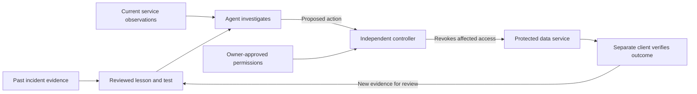

# BREACHSTOP: what to build from the evidence

**Research/design snapshot: October 9, 2026.** This is a proposed product, with a separate local reference experiment. A deployed autonomous defense, sponsor integrations, government pilot and measured national impact are not established.

## The product in ordinary language

Build a system that gives an institution a practical answer to four questions: **Who is accessing our private data? Is that access allowed? What can we safely stop right now? How do we know the repair worked?**

Small connectors observe each enrolled service. A coordinator combines those observations with source code, approved permissions and lessons from earlier incidents. A separate access-control service can stop a particular account from retrieving records. A repair worker prepares a fix. An independent checker confirms that the bad access stopped and that the expected public service still works.

The useful memory is a library of tested failure patterns. After a confirmed incident, the system gains a new check that can be applied to other relevant services. It does not gain unrestricted permission to modify those services or treat every similar incident as already proven.

## Refined proposal after the country and competitor research

**BREACHSTOP turns a documented leak mechanism into a repeatable defense test, rehearses a repair in an isolated copy, and checks the actual deployed outcome.** Keep application compromise and credential misuse as the main demonstration. Publication mistakes remain a separate module.

The [competitive review](../../competitor-profiles/_summary.md) found established products for simulation, coordinated AI workflows and remediation revalidation. Our proposed contribution is a small open-source implementation with inspectable evidence and tests. We have not demonstrated a unique market gap or superiority over those products.

The [country precedents](COUNTRY-PRECEDENTS.md) suggest adopting explicit institutional identities, independently enforced data access and a clear path from discovery to repair. They do not establish that any government eliminated leaks.

### What the sandbox adds

A **sandbox** is a disposable execution environment whose files, network access and resources are restricted. Build a small replica of the enrolled service from its source, dependencies and relevant configuration, replacing private data and secrets with fictional equivalents. It is a partial test environment, not a perfect digital copy of an institution.

Use three separately controlled jobs: patch preparation, baseline/candidate rehearsal, and independent outcome verification. The repair agent must not change the checker or its dependencies. A fourth trusted controller owns live containment and any later release; its credentials stay outside those jobs. See the [runtime comparison and concrete boundaries](SANDBOX-ARCHITECTURE.md).

| Stage | Concrete operation | Evidence required |
|---|---|---|
| Reproduce | Run the supported failure mechanism against the isolated baseline. | Actual unauthorized response bytes or records, plus source and configuration versions. |
| Prepare | Agent proposes the smallest repair allowed by the service contract. | Diff and scanner output; no changes to approved permissions or trusted tests. |
| Rehearse | Build a fresh candidate and repeat the failure and valid workflows. | Failure blocked, valid operations preserved, and any service interruption measured. |
| Contain | Separate controller disables confirmed compromised access under preapproved policy. | Requests using that old identity fail at the real enforcement point. |
| Release | Trusted executor promotes only the exact verified artifact to the owned demo service. | Artifact hash, deployed revision and an independent external check. |
| Remember | Save the approved mechanism and regression test for applicable services. | Source confidence, applicability, owner, policy version and held-out test results. |

Containment may happen before repair rehearsal finishes. These stages express responsibilities, not a requirement to wait while data continues escaping.

### What it must stop, and where

The demo must prevent a compromised application from bypassing the data gateway. Give it no direct database route, administrative credential or permission to broaden its own role. Revoke the identity at a separately protected enforcement point. A compromised process can still misuse records it was legitimately allowed to read before containment; the design reduces scope and duration, rather than promising zero initial exposure.

The newest [access-control research](ACCESS-AND-EXPOSURE-PAPERS.md) adds four checks: indirect permission chains, overly powerful child components, stale permissions after revocation, and information visible through query behavior despite empty results. Use those as explicit regression cases. A single denied HTTP response is not proof that every path is closed.

For a real host takeover, recover from a trusted image and replace affected credentials. Restoring one source file does not establish that the operating system is clean. This host-recovery extension is not implemented by the current application experiments.

### A stronger demo moment

Show the same fictional service before and after containment, while an independent legitimate service continues. Then offer a repair that looks correct in source but leaves a stale deployed artifact: the checker should reject it. Only the fresh, verified artifact can pass. Finally, rename the relevant resource and rerun a held-out case to demonstrate a general rule rather than a memorized path. These are measurable acceptance targets; a narration or green badge cannot substitute for the responses.

The future AI contribution is investigation and repair selection under those constraints. The current deterministic controls and synthetic experiments must remain labeled as such.

This is the proposed product flow. The local experiment exercises the access-control and outcome-checking portion, with the incident confirmation supplied by the test scenario.

## What past Argentine incidents can teach it

The [existing report](../../REPORT.md) distinguishes acknowledged disclosures, investigations and disputed allegations. Each lesson below is an engineering inference. It is not a claim to have reconstructed the incident or prevented it retrospectively.

| Evidence in the report | Reusable lesson | Proposed control and test | What it cannot establish |
|---|---|---|---|
| Police-described use of stolen account details in the October 2025 investigation | Correct credentials can still be used by the wrong person. | Separate service identities; narrow access; revoke a confirmed compromised credential and retry it from an independent client. | A request using a stolen credential is not automatically distinguishable from its owner's request. |
| Río Negro's acknowledged payroll disclosure and suspected employee misuse | Being an employee does not authorize every lookup. | Check record scope against an approved role and task; test another employee's record and an approved payroll batch separately. | Public reporting does not establish the complete mechanism or responsibility. |
| PAMI's documented publication of private supporting attachments | A public purchasing page and its medical attachments need different access rules. | Check the exact files at publication time and test them from an unauthenticated client after release. | A database-access gateway alone does not protect files already copied to a public website. |
| Alleged broker exposure, with the collection's provenance unresolved | Information can escape from an organization's copy or recipient. | Inventory recipients, narrow export permissions, record approved transfers and test access expiry. | Expiring access cannot erase a recipient's previous download. |
| IOMA/SCBA acknowledgments with incomplete public technical detail; disputed ANSES/Mi Argentina claims | Evidence quality must control confidence. | Save institution statements and unknowns; request relevant checks without inventing an exploit or automatically deploying a patch. | A news headline is insufficient evidence for selecting a specific code repair. |

The underlying primary announcements and reporting are linked in the [incident timeline](../INCIDENTS.md) and [causes chapter](../CAUSES.md). These cases require several kinds of control; a single “AI firewall” would not cover them all.

## What the papers change about the design

These are design conclusions drawn from the reviewed evidence, not performance promises:

- **Measure effects, not reassuring explanations.** PROVX's model-level intervention metric is distinct from host enforcement. Our checker must observe real access outcomes. [PROVX, §6.3](https://www.usenix.org/system/files/usenixsecurity26-wu-weiheng.pdf).
- **Keep the checker independent.** Writable evaluation machinery can report false success. The repair agent must not control the verdict. [BenchJack](https://arxiv.org/html/2605.12673v1).
- **Treat logs as untrusted evidence.** Malicious text in a log must never become permission to act. [LogInject](https://arxiv.org/html/2607.14493v1).
- **Memory needs validation.** CTI-REALM's curated guidance experiment motivates testing useful context; it does not establish autonomous learning from new breaches. [CTI-REALM, §5.7](https://arxiv.org/html/2603.13517v2).
- **Sharing models adds risks.** Cross-organization learning needs evaluation of poisoned contributors and privacy before rollout. [ENTENTE, §VI](https://www.ndss-symposium.org/wp-content/uploads/2026-s93-paper.pdf).
- **Removing a secret and disabling it are separate tasks.** Check deployment assets after rebuilding, and independently retry the old credential. [Keys on Doormats, §6.1](https://arxiv.org/html/2603.12498v3).

The full reviews preserve versions, metrics and limitations. See [search coverage](SEARCH-PROTOCOL.md), [defense and repair](AUTONOMOUS-DEFENSE-PAPERS.md), [agent safety](AGENT-SAFETY-PAPERS.md), [incident learning](LEAK-LEARNING-PAPERS.md) and [threat intelligence and evidence integrity](THREAT-INTELLIGENCE-PAPERS.md).

## How an old incident becomes a future defense

1. **Make an evidence card.** Record the source, dates, what was confirmed, what remains unknown, and which mechanism is actually supported. Keep private records and reusable credentials out of this library. A case with unknown cause stays unknown.
2. **Describe the failure without incidental names.** For example: “A credential remained usable after exposure was confirmed,” rather than “block this particular address.” This makes the lesson useful after the attacker changes accounts, machines or request pace.
3. **Write the expected rule.** For example: “After identity A is revoked, it cannot read another record; the separately approved batch identity B can continue.” The institution approves the permissions. The model cannot invent them.
4. **Create a synthetic reproduction and a legitimate-use counterpart.** One proves the unwanted outcome is possible before the control. The other prevents a fix that merely shuts everything down.
5. **Test variations that were not used to write the control.** Change record IDs, ordering, request pace and service names. Include incomplete evidence and a valid large export. Measure false blocks as well as missed abuse.
6. **Promote the lesson through explicit stages.** `candidate → reproduced → reviewed → tested → limited rollout → active`. Preserve the policy version, source links, checker version and failures. Summaries of the same report are not independent confirmation.
7. **Apply it where the mechanism fits.** Another service receives a check. Its owner, data flow and permissions determine whether a change is appropriate. Observe the limited rollout before enabling broader enforcement.

This is learning through a growing regression library: a set of tests that ensure a known failure does not quietly return. It does not require training a new model. It also cannot guarantee protection against an unknown mechanism the controls do not cover.

## Components and responsibilities

| Component | Concrete responsibility | Required boundary |
|---|---|---|
| Service connector | Report service identity, deployed revision, request outcomes and health. | A missing or compromised connector must not be the only source of truth about data access. |
| Data-access service | Authenticate requests and enforce record/operation permissions before returning data. | Applications have no alternate database credential or network route around it. This must be tested in deployment. |
| Incident coordinator | Combine evidence, retrieve approved lessons and propose an allowed action. | It receives limited tools and sanitized evidence, not unrestricted database or deployment administration. |
| Response controller | Validate and execute revocation for a specific identity. | It independently checks target, authorization, evidence freshness, expiry and duplicate commands. |
| Repair worker | Prepare and scan a patch in an isolated checkout. | It cannot edit policy, test expectations, evaluator dependencies or production secrets. |
| Release and verification service | Deploy the exact checked revision, provision replacement access and test real outcomes. | It collects its own responses and rejects restoration if required checks fail. |
| Lesson registry | Store reviewed cases, tests, versions and applicability. | Retrieved text is evidence; only approved policy versions can authorize changes. |

An **identity** is an account or credential assigned to a particular service. **Revocation** means the receiving system stops accepting it. **Containment** means restricting the affected component so the incident cannot keep spreading through that path. **Recovery** means restoring the repaired, checked service, not re-enabling the old compromised credential.

Track evidence on two separate dimensions: whether collection preserved the record, and how strongly that record supports the conclusion. An authentic log can faithfully preserve misleading activity or an attacker's text. A valid signature establishes neither the truth of a message nor permission to follow it.

## The first complete product demonstration

Use two tiny applications, A and B, and a protected service containing fictional citizen records. Give A and B separate identities. Seed one clearly labeled credential-disclosure fixture in A; the test is not a claimed discovery in Argentina.

The audience sees the following evidence in one continuous run:

1. A test client obtains the synthetic credential and successfully retrieves records. An independent client records exactly which fictional IDs arrived.
2. ClickHouse correlates the actual activity. The Guild-hosted agent reads the approved contract and a real Semgrep finding before proposing containment or editing code.
3. The controller revokes A. The old credential fails on the next completed request after revocation takes effect. Measure propagation delay and any in-flight responses rather than assuming instant global cancellation.
4. B's approved batch continues. A's affected legitimate operation may be temporarily unavailable; show that cost.
5. The agent prepares a repair and opens a real GitHub PR with sanitized evidence. A separate checker tests the original disclosure, variations, permissions and legitimate use.
6. A controlled release deploys the exact tested revision and provisions fresh access. A recovers; the old credential remains invalid. An external client verifies the public HTTPS deployment.

This is the intended three-sponsor, real-action hackathon product. The [fit assessment](../HACKATHON-FIT.md) records the event constraints. A local reference experiment proves only individual control behaviors; it does not satisfy the whole event challenge or reproduce the agent workflow.

## Acceptance evidence before claiming success

- **Exposure:** count actual unauthorized record transmissions and distinct fictional records received, before and after intervention. Count attempts separately.
- **Continuity:** count completed legitimate operations for both services; report A's interruption and B's availability separately.
- **Latency:** distinguish time until compromise evidence exists, time to decide, time to enforce, and time to verify. An instant simulated event is not a measured detector.
- **Repair:** verify the intended flaw and unseen variants, not merely that a scanner finding disappeared. Retain the exact source and deployment revision.
- **Exposure removal:** inspect the built and deployed assets, including a subsequent rebuild, so removing a secret from source cannot mask continuing publication. Test revocation independently of this check.
- **Authority:** deny an unrelated target, an expired action and replayed or stale commands. Keep attacker-controlled log text from changing any permission.
- **Learning:** compare the same held-out scenarios with and without the reviewed lesson. If the lesson adds no measured benefit, do not describe memory as an improvement.

The baseline should include ordinary permissions and deterministic controls. Otherwise we would only prove that adding access control beats having none. The AI's additional value must be measured separately: useful investigation, a correct repair or reduced response effort at an acceptable error rate.

## Development order and remaining work

First establish real authorization and revocation behavior with independent requests. Then connect the three sponsor tools to the same evidence trail. Add isolated repair and exact-revision verification, followed by the public action and recovery loop. Only after that should the agent propose a lesson for another service and demonstrate held-out transfer.

Publication checks, recipient/export controls, broader host telemetry and cross-institution learning remain distinct workstreams. They are necessary to address more of the Argentina report; the first application demonstration does not make them complete. Production host compromise also requires trustworthy host evidence, a clean recovery process and protection of the controller and deployment system. If an attacker controls those trusted components, our current application-level assumptions do not establish protection.

The strongest honest claim is: **we can test and demonstrate how a specific access path is contained, repaired and checked, and turn that mechanism into a reusable defense test.** Existing leaked copies, every possible intrusion and national economic savings remain outside what this prototype can prove.
